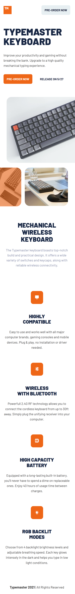

# Frontend Mentor - Typemaster pre-launch landing page solution

## Welcome! 👋

Thanks for checking out this front-end coding challenge.

[Frontend Mentor](https://www.frontendmentor.io) challenges allow you to improve your skills in a real-life workflow.

## The challenge

This challenge is to build out this landing page and get it looking as close to the design as possible.

I can use any tools you like to help you complete the challenge. So if you've got something you'd like to practice, feel free to give it a go.

# LIVE SITE:

# ➡️ https://pettik-typemaster-landing-page.netlify.app/ ⬅️

# DESKTOP version 🖥️ ⬇⬇⬇

# TABLET version 💻 ⬇⬇⬇

# MOBILE version 📱 ⬇⬇⬇

### Links

- Solution URL: [Link to solution](https://github.com/pettik/FrontendMentor--typemaster-prelaunch-landing-page)
- Live Site URL: [Link to live site](https://pettik-typemaster-landing-page.netlify.app/)
